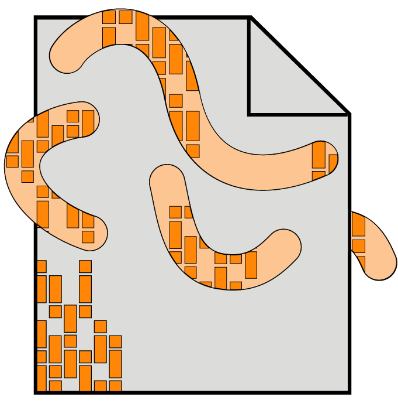

I’m Friso van Dijk. Twenty of Time is the platform I created to present my views on information technology. Each post is a result of questions I take the time to dive into. These personal investigations are presented in well-researched articles, from an enquiry about <a href="{{site.url}}/2018/dead-european-cookie-law/" target="blank">why a technology law is flawed</a> to a look at <a href="{{site.url}}/2019/malware-analysis/">how malware is fought</a>.

<figure class="imgright">
    
</figure>

What fascinates me most are the values we imbue in our IT. Is it okay to <a href="/2018/surveillance-internet-business-model/">intimately track people</a>? How do we <a href="/2019/unjust-technology-legislation-3/">balance economic and civil interests</a> in technology law? Foundational for me are the responsible use of personal data, awareness of (intended) bias in the use of IT and a general regard for human rights in the digital space.

I’m aware that different views exist and try to present them when relevant, but you may find they are not fully represented. Twenty of Time is open for submissions of both supporting and opposing views. Everyone is welcome to join the conversation, be it through a comment or a guest post.

If these topics interest you, subscribe to get monthly updates of Twenty of Time. Just leave your e-mail in the box below.



## About Friso

I’ve always had a strong sense of justice. During my studies I started recognising how we imbue our values in IT. I saw how the use of IT can do both good and bad. How some of it comes from uninformed decisions, while others are motivated by greed and power.

<figure class="imgleft">
    
</figure>

My personal investigations in these subjects reached the point where I wanted to share them with the world. Thus Twenty of Time was born. My perspective is different from most, in that I do both scientific research, work in the Dutch government as an IT adviser and have a personal business. This means I can see things from both a personal as well as a professional view. I add to that with technical knowledge as a web developer. programmer and data enthusiast.

Alongside my interest in technology, I’m enjoying life in The Netherlands together with my fiancée. As a fellow human, I enjoy all the commonalities such as food, music and other humans. I consume a lot of books, from Russian literary classics to science-fiction to investigative journalism.

Part of what I enjoy about having a blog is the entire creative process. Telling stories and enriching them with illustrations is a large part of all this. The other is designing and building the website to be an awesome reading experience. It’s as much a creative outlet as it is about sharing what I know and learn.

If you want to get in touch with me, you can use the form below or find me on <a href="https://www.linkedin.com/in/frisovandijk/" target="blank">LinkedIn</a>. If you want to learn more about me, check out my personal site at <a href="https://www.frisovandijk.com" target="blank">frisovandijk.com</a>

<form method="POST" class="page_email" action="https://formspree.io/mail@twentyoftime.com">
  <h3>Contact me</h3>
  <input type="email" name="email" placeholder="E-mail">
  <input type="text" name="name" placeholder="Name">
  <textarea name="message" placeholder="Your Message"></textarea>
  <button type="submit">Send E-Mail</button>
</form>

## Collaborate with me

I frequently get contacted for collaboration projects and I’d love to do more of them. Whether it’s an interview, a case study or a look at your product, feel free to discuss them with me.

<figure class="imgright">
    
</figure>

For those who got inspired by what I wrote, Twenty of Time is open to publications by guest authors. This includes those with opinions different from mine. The only requirements are relevance, quality and verifiability of claims. Share your idea through the form below (I won’t steal it) and I’ll get back to you.

I would also love it if you’re an artist and want to work together on one of my posts. People have many different views about how to express something as abstract as technology. It leads to very distinct results which somehow all feel very relatable. If you’re reading this and want to illustrate a post on Twenty of Time in any form, leave a message below.

(For techies with ideas: aside from the header and footer, every page can be freely designed.)

## Housekeeping announcements

I share my personal views through my articles. This may spark a discussion, one in which everyone is welcome to participate. In return, I would request you to be respectful of others and their opinions. Fierce discussion is allowed, but I will not hesitate to act on rude and disrespectful behaviour.

<figure class="imgleft">
    
</figure>

All illustrations are licensed under the <a href="https://creativecommons.org/licenses/by/4.0/" target="blank">creative commons license 4.0</a>. You are free to use it with clearly displayed attribution. Proper attribution is either a link to the homepage, the about page or the page the image came from. This is not a link to the image itself. I retain full rights to the textual content (aside from fair use of course). Don’t let this stop you from asking about translating or creative use of my texts.

If you decide to make creative use of any of my material, I’d love to know about it and share it. Let me know if you want more resources than those provided through the website (illustrator or SVG files, source code) and I’ll how I can help you.